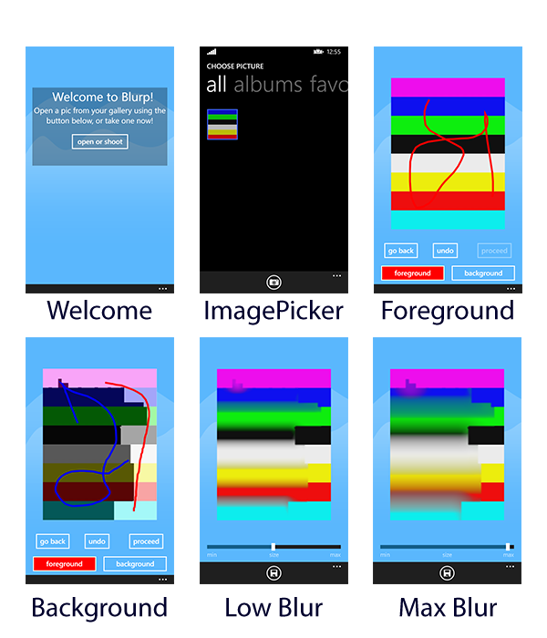

# Blurp

Blurp is a Windows Phone 8.0 app, built using the Nokia Imagine SDK.
The goal of the app was using the APIs of the SDK to deliver a simple app capable of definining the foreground and the background of an app and apply blur effects to it.

Below here, a series of screenshots that show the content of the app:

## How is it built?

The app relies on the following plugins and extensions:

* AdDuplex for Windows Phone
* BugSense, WP8
* RateMyApp
* Nokia Imaging SDK (now known as Lumia Imaging SDK)